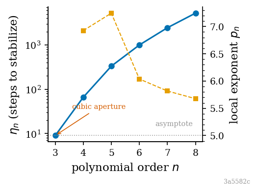
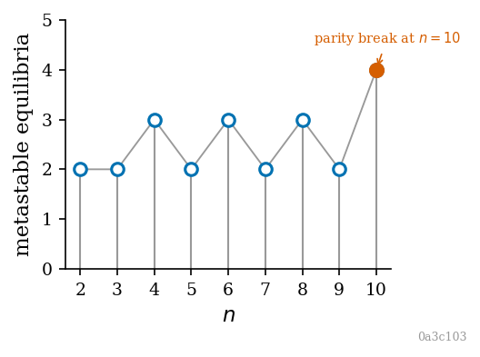
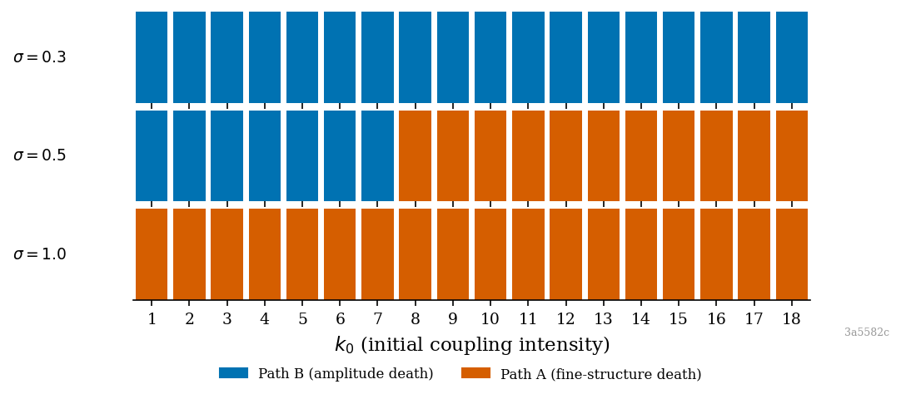

# sr-compute

Scientific instrumentation for [Semantic Relativity](https://zenodo.org/records/19560610), a geometric field theory for observer-dependent meaning. This repository implements the operator stack from Appendix A of the paper as numerical simulations on 1+1D toy models. Each module maps to a named object in the SR formalism — this is not a generic PDE solver.

The process of building it has also refined the theory it implements.

## Install

```bash
python -m venv .venv
source .venv/bin/activate
pip install numpy scipy pytest matplotlib
pip install -e .          # installs sr_compute.diagnostics as an importable package
```

## Figures

Regenerate all figures from committed text reports:

```bash
make figures
```



$\eta_n$ vs $n$, polynomial order sweep $n=3..8$. The local exponent $p_n = \log(\eta_n/\eta_{n-1})/\log(n/(n-1))$ decreases from 6.9 toward 5; $\eta_3=9$ is the cubic aperture. Data from commit `3a5582c`. [PDF](docs/figures/polynomial_sweep/eta_ladder.pdf)



Prominence-thresholded ($0.04$) count of Morse maxima on $\mathcal{V}_n$, $n=2..10$. Alternating 3-for-even, 2-for-odd pattern through $n=8$ breaks at $n=10$ when an inner fold-point maximum crosses the prominence threshold. This is instrument readout under a chosen prominence, not a singularity-theoretic invariant. Data from commit `3a5582c`. [PDF](docs/figures/polynomial_sweep/count_sequence.pdf)



$(k_0, \sigma)$ outcome grid for $n=4$. $\sigma=0.3$: universal Path B. $\sigma=0.5$: bimodal with clean boundary between $k_0=7$ and $k_0=8$. $\sigma=1.0$: universal Path A. Edges of the $\sigma$-window are open. Data from commit `3a5582c`. [PDF](docs/figures/polynomial_sweep/sigma_window.pdf)

## Architecture

```
sr-compute/
├── sr_compute/                  # Installable public API (pip install -e .)
│   └── diagnostics.py           # κ, η, measurement 1, arnold_class
├── shared/                      # Math primitives (general n), heavily tested
│   ├── potentials.py            # V_eff, Phi, A(C), brake quadrature
│   ├── reconstruction.py        # F_n(psi_bar), dC/d(psi_bar), h(C), ReconstructionLUT
│   ├── coupling.py              # Gaussian kernel, kappa_n, periodic K matrix
│   ├── brake.py                 # zeta, analytical vs numerical dB/dC
│   ├── metrics.py               # The four Thread 7 measurements
│   └── visualization.py         # Style module: apply_style, COLORS, FIGSIZE, save, annotate_commit
├── models/
│   └── dim_1plus1/
│       ├── cfe.py               # Laplace-Beltrami, CFE RHS, integrate_cfe (fixed g)
│       └── mfe.py               # MFE RHS, coupled IVP in log(g), run_simulation
├── experiments/
│   └── polynomial_sweep/
│       ├── config.py            # All baseline parameters and per-n solver overrides
│       ├── run.py               # Sweep driver (--quick, --n)
│       ├── analyze.py           # Writes results/analysis.txt
│       ├── outcome_utils.py     # completed / terminal / timeout labels
│       ├── parity_experiment.py
│       ├── snapshot_experiment.py
│       ├── robustness_experiment.py
│       ├── ensemble_experiment.py
│       ├── bimodal_basin_experiment.py
│       ├── coupling_scale_experiment.py
│       ├── arnold_classification_report.py
│       ├── results/             # Committed text reports; .npz/.json excluded by .gitignore
│       └── figures/             # Figure scripts; read from results/, write to docs/figures/
├── docs/
│   └── figures/
│       └── polynomial_sweep/    # Committed PNG + PDF (regenerate with `make figures`)
├── tests/                       # pytest suite (90+ tests)
├── Makefile                     # `make figures` rebuilds all figures from committed text reports
├── pyproject.toml
└── pytest.ini                   # pythonpath = .
```

The coupled IVP state is `concat(C, log g)` (length 2N). The `log g` representation keeps the metric positive throughout integration. Terminal solver events (metric floor or ceiling) produce `outcome=terminal`, not failure. Stiff high-order runs use Radau via per-n overrides in `config.py`.

`ReconstructionLUT` precomputes the coarse-graining inverse `h(C)` on a dense grid and uses `np.interp` in the coupled RHS, replacing per-step `brentq` calls. This makes full-resolution (N=256) runs practical on a laptop. For even n, the LUT has a C_floor below which `h(C)` is undefined (principal-branch limit) — the basin experiments expose this as a physical domain constraint on IC amplitude.

## Findings

Results from the polynomial-order sweep n=2..10 in the 1+1D model.

**Interpretive proportionality (R25).** κ(Π) = 1 exactly at n=3, algebraic identity (exponent n−3 = 0). At n=4, κ ≈ 3.98, confirming supercubic amplification of spatial dynamic range.

**Composite landscape geometry.** All critical points of the pullback landscape V_n = V_eff ∘ F_n are Morse (A₁, non-degenerate) for n=2..10 at baseline parameters. Proved symbolically by `arnold_class` in `sr_compute.diagnostics`. There is no Arnold ADE tower indexed by polynomial order — every critical point carries a non-vanishing second derivative at baseline SR parameters.

**Metastable count sequence.** Prominence-thresholded local maxima of V_n under `count_metastable_states` (`peak_prominence=0.04`, `peak_distance=120`). This is an instrument readout, not a structural theorem:

| n | 2 | 3 | 4 | 5 | 6 | 7 | 8 | 9 | 10 |
|---|---|---|---|---|---|---|---|---|---|
| count | 2 | 2 | 3 | 2 | 3 | 2 | 3 | 2 | 4 |

The n=10 entry breaks the alternating pattern when an inner fold-point maximum crosses the prominence threshold. The count depends on `peak_prominence` and `peak_distance` — see `shared/metrics.py`.

**η ladder.** Nonlocal correction growth for n=3..8: 9 → 66 → 332 → 999 → 2449 → 5226. Successive ratios (7.3, 5.0, 3.0, 2.45, 2.13) decrease monotonically. The local power-law exponent asymptotes toward ≈5. Growth is sub-exponential, not factorial. η₃=9 is the only value small enough for the brake to hold without truncation — the empirical signature of n=3 as the unique cubic aperture.

**n=4 breakpoint.** κ ≈ 3.98, spectral ratio ≈ 0.519, and the only coarsening growth rate >1 (1.197) in the sweep dataset. Three independent channels spike simultaneously at n=4.

**Dynamical regime transition.** The snapshot and solver-parity experiments resolve a qualitative shift between n=4 and n=5: at n=3,4 the metric hits a terminal event during the structured-field window; at n=5,6 integration reaches t=30 without that termination and coherence relaxes toward homogeneity between t≈8 and t≈15. Solver-parity controls (Radau vs RK45) support treating this as physical rather than a solver artifact.

**n=4 bimodal basin.** At A=10⁻² and σ=0.5, path assignment is discriminated by initial wavenumber k₀ with a clean boundary at k₀=7|8: Path B (amplitude death) for k₀=1..7, Path A (fine-structure death) for k₀=8..10. Path assignment is amplitude-independent per seed in the tested range. IC power spectra (94-98% of power above k₀=7, dominant modes scattered across seeds) do not explain the seed-wise A/B split.

**σ as bifurcation parameter.** σ enters the dynamics as a scalar prefactor via ζ_cubic ∝ σ⁻³ in the brake and ∝ σ⁻² in the MFE — it does not spatially filter the IVP. A coupling-scale sweep shows bimodal coexistence is not generic at n=4 but a σ-window phenomenon: at σ=0.3 all tested k₀ are Path B, at σ=0.5 the k₀ threshold appears, at σ=1.0 runs decay to zero without terminal events. Neither k₀^crit · σ ≈ const nor a σ-independent threshold holds across those regimes.

**Open:**
- σ-window boundaries and the full (σ, k₀) bifurcation diagram; bifurcation class at the window edges
- Seed-to-path discriminator at n=4 when amplitude and power spectrum do not discriminate (candidates: sign-region asymmetry, ∫ψ̄₀³ dx, zero-crossing count, complex phase structure)
- η asymptotic exponent as n→∞
- Metastable count behavior beyond n=10

## The four measurements

| Function | Measurement | What it tests |
|---|---|---|
| `count_metastable_states` | 1 | Prominence-thresholded maxima on the ψ̄ landscape |
| `interpretive_condition_number` | 2 | R25 (interpretive proportionality) |
| `spectral_concentration_ratio` | 3 | R27 (Fisher-Rao identification) |
| `nonlocal_correction_growth` | 4 | RG marginality / non-local brake mismatch |

All four are re-exported from `sr_compute.diagnostics`. `arnold_class` lives in the same module and classifies critical points of V_n by exact polynomial derivatives — it is not one of the four sweep measurements.

## Theory in brief

SR couples a coherence field C(x,t) and a metric g(x,t) through three field equations: CFE (coherence evolution), RFE (curvature sourcing), and MFE (metric evolution). For the 1+1D implementation:

- Coarse-graining at order n: C = ψ̄ + γₙ ψ̄ⁿ (`psi_bar`, `gamma`, `n` in code)
- Effective potential: V_eff(C) = (μ²/2) C² − α_φ C⁴
- The CFE reaction term ascends V_eff; stable equilibria at ±C*, origin unstable
- Coupling tensor K and brake functional B[K] follow Appendix A sections A.1.2–A.1.3
- At n=3, numerical dB/dC matches the analytical local formula; they diverge for n>3 by design — that divergence is what measurements 3 and 4 track

## Parameters

Seven free parameters: `sigma`, `gamma`, `mu_sq`, `alpha_phi`, `lambda_b`, `eta_g`, `xi_g`. All implementations take these as arguments; there are no hidden globals. Discrete kernels also require grid spacing `dx`.

Baseline values (Thread 7): μ²=1.0, α_φ=1.0, γ=1.0, σ=0.5, λ_B=0.5, η_g=1.0, ξ_g=0.1. These are calibration settings (signal visible on the instruments), not fitted values. See `experiments/polynomial_sweep/config.py`.

## Running tests

```bash
pytest tests/ -v
```

90+ tests. Notable checks: round-trip reconstruction, LUT vs `brentq` tolerance, n=3 analytical/numerical brake agreement, metastable count at n=3,4, `arnold_class` returns Morse for n=2..10, sweep driver end-to-end on quick settings, robustness and ensemble experiments in quick mode. If a third-party pytest plugin breaks collection: `PYTEST_DISABLE_PLUGIN_AUTOLOAD=1 pytest tests/ -v`.

## Running experiments

Full polynomial sweep (N=256, n=2..10 by default, several minutes on a laptop):

```bash
python -m experiments.polynomial_sweep.run
```

Quick calibration sweep (N=32):

```bash
python -m experiments.polynomial_sweep.run --quick
```

Run specific n values:

```bash
python -m experiments.polynomial_sweep.run --n 7 8
```

Aggregate report from saved sweep artifacts (writes `results/analysis.txt`):

```bash
python -m experiments.polynomial_sweep.analyze
```

Solver parity experiment:

```bash
python -m experiments.polynomial_sweep.parity_experiment
```

Intermediate-time snapshot (n=4,5,6; writes `results/snapshot_report.txt`):

```bash
python -m experiments.polynomial_sweep.snapshot_experiment [--quick]
```

Parameter robustness (baseline + 12 single-parameter perturbations, n=3,4,5; writes `results/robustness_report.txt`):

```bash
python -m experiments.polynomial_sweep.robustness_experiment [--quick]
```

Multi-seed ensemble at n=4 with n=3 control (writes `results/ensemble_report.txt`):

```bash
python -m experiments.polynomial_sweep.ensemble_experiment [--quick]
```

Bimodal basin characterization at n=4 — IC amplitude sweep + sinusoidal wavenumber sweep (writes `results/bimodal_basin_report.txt`):

```bash
python -m experiments.polynomial_sweep.bimodal_basin_experiment [--quick]
```

Symbolic Arnold-class table over n=2..10 (writes `results/arnold_classification.txt`):

```bash
python -m experiments.polynomial_sweep.arnold_classification_report
```

Coupling-scale experiment — IC power spectra for basin seeds + σ sweep (writes `results/coupling_scale_report.txt`):

```bash
python -m experiments.polynomial_sweep.coupling_scale_experiment [--quick]
```

## Dependencies

- Python 3.10+
- NumPy, SciPy (linalg, integrate, signal, ndimage, optimize)
- matplotlib 3.10.9 (figure scripts only; see `requirements.txt`)
- pytest

## License

MIT. See [LICENSE](LICENSE).

## Contact

[Diesel Black](https://diesel.black/)

## Acknowledgments

Built in a multi-agent workflow: Diesel Black (∂²g/∂t² ≠ 0) contributing architecture and engineering direction; Claude Opus (∂g/∂t = 0) providing mathematical grounding and specification from the full SR corpus; Cursor Agent and Claude Code constructing the codebase.
